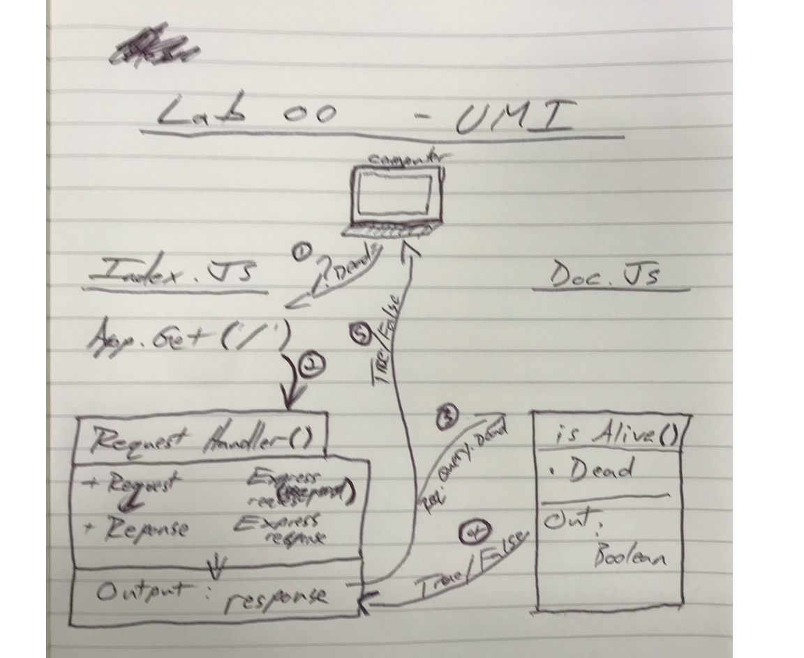

# LAB -00

## Proof of Life Server

### Author: Brad Elliott

### Links and Resources
* [submission PR](https://github.com/BGElliott206/lab00-deployment-workshop)
* [travis](https://www.travis-ci.com/BGElliott206/lab00-deployment-workshop/builds/123810005)

* [front-end](https://bradelliott-lab00.herokuapp.com/) (when applicable)

#### Documentation

* [jsdoc](https://bradelliott-lab00.herokuapp.com/docs/) (Server assignments)

### Modules
#### `pos.js`
##### Exported Values and Methods

###### `isAlive(dead) -> boolean`
returns true/false to indicate how the server works

### Setup
#### `.env` requirements
* `PORT` - Port Number

#### Running the app
* `npm start`
* Endpoint: `/`
  * Returns a boolean.
* Endpoint: `/docs`
  * Returns JSDoc documentation pages.
  
#### Tests
* Unit Tests: `npm test`
* Lint Tests: `npm run lint`

Incomplete Tests:

-need to test xyz

#### UML
